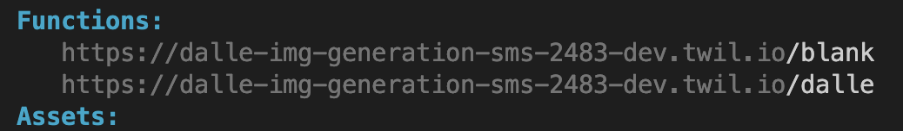
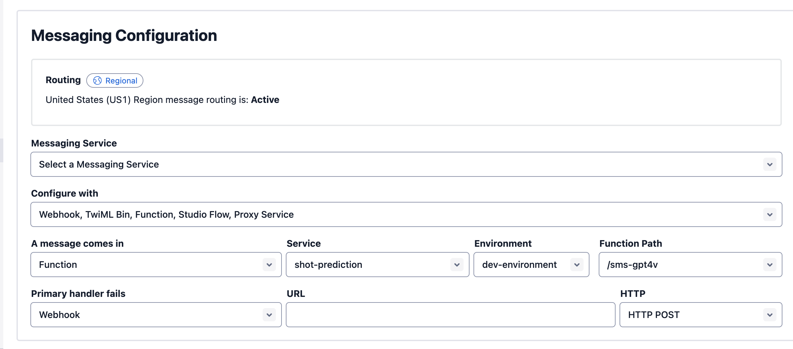

You'll need 
- an OpenAI API Key. You can [get one here](https://platform.openai.com/account/api-keys)
- A Twilio account - sign up for a free [Twilio Account here](https://www.twilio.com/try-twilio)
- A Twilio Phone Number with SMS capabilities - [learn how to buy a Twilio Phone Number here](https://support.twilio.com/hc/en-us/articles/223135247-How-to-Search-for-and-Buy-a-Twilio-Phone-Number-from-Console)
- Node.js installed - [download Node.js here](https://nodejs.org/en/download/)

### Set an Environment Variable with Twilio Functions and Assets
Open up your <em>.env file</em> for your Functions project in your root directory and add the following line:
```bash
OPENAI_API_KEY=YOUR-OPENAI-API-KEY
```
### Configure the Serverless Function with a Twilio Phone Number
To open up our app to the web with a public-facing URL, run `twilio serverless:deploy` from the root directory.

Grab the Function URL corresponding to your app (the one that ends with <em>/sms-gpt4v</em>) and configure a Twilio phone number with it as shown below: select a Twilio number you purchased in your Twilio phone numbers console and scroll down to the Messaging section. Paste the link in the text field for A MESSAGE COMES IN webhook making sure that it's set to HTTP POST. When you click <strong>Save</strong> it should look like this!

Now take out your phone and text a question or prompt to your Twilio number.